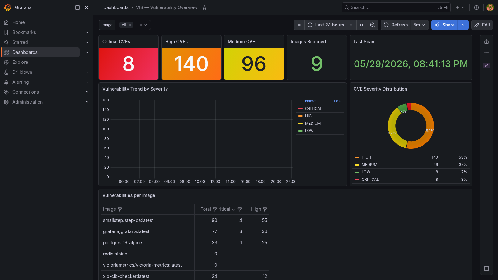

# VIB — Vulnerability in a Box

**One `docker compose up` to scan every running container for CVEs and visualise them in Grafana.**

VIB discovers all images running on the Docker host, scans them with [Trivy](https://aquasecurity.github.io/trivy/), ships the results to VictoriaMetrics, and shows you a live dashboard — no agents, no cloud accounts, no API keys required.

Part of the [in-a-box-tools](https://in-a-box-tools.tech) ecosystem.

---

## What you get

| Component | Purpose |
|-----------|---------|
| **Trivy scanner** | CVE scanning via Docker socket — OS packages + language deps |
| **VictoriaMetrics** | Lightweight Prometheus-compatible storage (90 day retention) |
| **Grafana** | Pre-built dashboard: severity counts, trend chart, per-image table, CVE list with NVD links |



---

## Quick start

```bash
git clone https://github.com/matijazezelj/vib.git
cd vib
cp .env.example .env          # edit as needed
make up
```

Open **http://localhost:3001** — login `admin` / your `GRAFANA_ADMIN_PASSWORD`.

The first scan starts immediately and completes in 5–15 minutes depending on image count and network speed (Trivy downloads the vuln DB on first run).

---

## Requirements

- Docker + Docker Compose v2
- The VIB `vib-scanner` container needs `/var/run/docker.sock` mounted (included in `docker-compose.yml`)

---

## Configuration

Copy `.env.example` to `.env` and adjust:

| Variable | Default | Description |
|----------|---------|-------------|
| `GRAFANA_ADMIN_PASSWORD` | auto-generated | Grafana admin password |
| `GRAFANA_PORT` | `3001` | Host port for Grafana |
| `VICTORIAMETRICS_PORT` | `8429` | Host port for VictoriaMetrics |
| `SCAN_INTERVAL_HOURS` | `6` | How often to re-scan (hours) |
| `SCAN_ON_STARTUP` | `true` | Run a scan immediately on start |
| `SEVERITY_FILTER` | all | Severities to report (`CRITICAL,HIGH,MEDIUM,LOW,UNKNOWN`) |
| `IGNORE_UNFIXED` | `false` | Only report CVEs that have a fix available |
| `TRIVY_TIMEOUT` | `300` | Trivy timeout per image (seconds) |
| `ADDITIONAL_IMAGES` | — | Extra images to scan beyond running containers |
| `AIB_BASE_URL` | — | AIB URL to feed critical/high findings into asset graph |
| `AIB_API_TOKEN` | — | AIB API token |

---

## Metrics

VIB pushes these metrics to VictoriaMetrics (queryable as Prometheus):

| Metric | Labels | Description |
|--------|--------|-------------|
| `vib_vulnerabilities_total` | `image`, `severity`, `has_fix` | CVE count per image/severity |
| `vib_cve_info` | `image`, `cve_id`, `package`, `severity`, `has_fix` | One series per CVE (value = CVSS score) |
| `vib_scan_timestamp` | `image` | Unix timestamp of last scan per image |
| `vib_image_vulnerabilities_total` | `image` | Total CVE count per image |
| `vib_images_scanned_total` | — | Total images scanned in last run |
| `vib_total_vulnerabilities` | — | Total CVEs found in last run |
| `vib_last_scan_timestamp` | — | Unix timestamp of last full scan |

---

## Useful commands

```bash
make up          # start the stack
make down        # stop
make logs        # follow all container logs
make scan-now    # trigger an immediate scan
make build       # rebuild scanner image
make clean       # stop and delete all volumes (destroys data)
```

---

## AIB integration

VIB can feed critical and high-severity findings into [AIB (Asset Inventory in a Box)](https://github.com/matijazezelj/aib), enriching your asset graph with live vulnerability data. See [docs/integrations.md](docs/integrations.md).

---

## In-a-box ecosystem

| Tool | What it does |
|------|-------------|
| [SIB](https://github.com/matijazezelj/sib) | Security Intelligence in a Box — alert triage via LLM |
| [AIB](https://github.com/matijazezelj/aib) | Asset Inventory in a Box — asset graph |
| [OIB](https://github.com/matijazezelj/oib) | Observability in a Box |
| [NIB](https://github.com/matijazezelj/nib) | Notifications in a Box |
| **VIB** | **Vulnerability in a Box** |

---

## License

MIT
